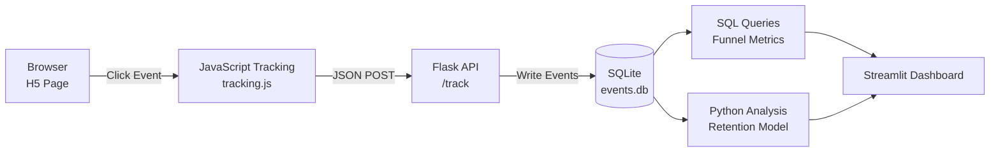

# H5 Web Event Tracking & Funnel Analytics System

> Lightweight Web Event Tracking + Funnel Analysis + Cohort Retention + Streamlit Dashboard

---

## Project Overview

This project simulates a game activity page / e-commerce landing page analytics pipeline, implementing a full end-to-end data flow:

- Frontend event tracking (JavaScript)
- Backend API collection (Flask)
- SQLite database storage
- SQL funnel analysis
- Cohort retention analysis
- Interactive visualization dashboard (Streamlit)

The system demonstrates how user click events become business metrics.

---

# System Architecture & Data Flow

## Repository Structure

* **`/frontend`**: Contains the mock H5 product page (`index`) and the core `tracking.js` SDK engineered to capture user interactions (page views, clicks, specific event triggers) with low latency.
* **`/backend`**: A lightweight Python server (`server.py`) acting as the data receiver, along with database initialization scripts (`init_db.py`).
* **`/data`**: Houses the SQLite database (`events.db`) and a synthetic data generator (`generate_synthetic_events.py`) built to simulate realistic user traffic and edge cases at scale.
* **`/analysis`**: Python scripts (`funnel_and_retention.py`) leveraging Pandas and Matplotlib to extract raw events, compute multi-stage conversion funnels, and generate actionable cohort retention matrices (`retention_matrix.png`).

---

## Key Business Value

* **Full-Stack Visibility:** Eliminates the "black box" of frontend user behavior without relying strictly on expensive third-party tools (like GA or Mixpanel).
* **Actionable Retention Metrics:** Automatically groups users into cohorts to track drop-off rates over time, enabling precise product iteration.
