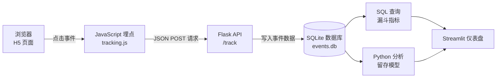

# H5 Web 埋点与漏斗分析系统

> 轻量级 Web 埋点系统 + 漏斗分析 + Cohort 留存分析 + Streamlit 可视化仪表盘

---

## 项目简介

本项目模拟游戏活动页 / 电商落地页的数据分析场景，构建了一个完整的数据链路，实现从用户点击到业务指标生成的全过程。

核心流程包括：

- 前端行为埋点（JavaScript）
- 后端事件接收（Flask API）
- SQLite 数据库存储
- SQL 漏斗转化分析
- Cohort 留存分析
- Streamlit 可视化展示

该系统展示了如何将用户行为数据转化为可用于决策的业务指标。

---

## 系统架构与数据流



## 核心功能

### 1️⃣ Web 行为埋点

追踪事件：

- `page_view`
- `signup`
- `purchase`

事件结构示例：

```json
{
  "event_name": "signup",
  "user_id": "user_001",
  "timestamp": "2026-03-08T07:28:39",
  "metadata": {}
}
```

## 2️⃣ 漏斗分析（Funnel Analysis）

计算指标：

- 独立访问用户数  
- 独立注册用户数  
- 独立购买用户数  
- 访问 → 注册 → 购买 转化率  

示例 SQL：

```sql id="9v6b7y"
SELECT 
  COUNT(DISTINCT CASE WHEN event_name='page_view' THEN user_id END) AS page_users,
  COUNT(DISTINCT CASE WHEN event_name='signup' THEN user_id END) AS signup_users,
  COUNT(DISTINCT CASE WHEN event_name='purchase' THEN user_id END) AS purchase_users
FROM events;
```

## 3️⃣ Cohort 留存分析

- 以首次 `page_view` 作为 Cohort 起点  
- 计算 D0–D14 留存率  
- 生成留存矩阵与热力图  

---

## 4️⃣ 可视化仪表盘

启动：

```bash
streamlit run analysis/funnel_dashboard_streamlit.py
```
支持功能：

- 时间范围筛选
- 自定义漏斗步骤
-实时转化率计算
-数据导出（CSV）
